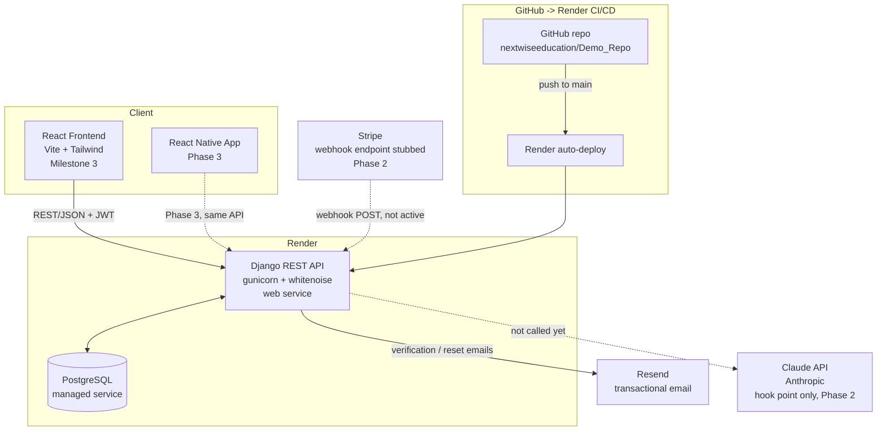

# Architecture — Milestone 1

## System overview

## Notes

- **React frontend → Django REST API → PostgreSQL** is the core request path. The frontend doesn't exist yet in Milestone 1 (it's Milestone 3 scope) — the API is being built REST-first specifically so it and the future React Native app (Phase 3) consume the identical interface.
- **Resend** handles verification and password-reset emails via `django-anymail`, using Django's standard `send_mail`, so no Resend-specific code lives outside `config/settings`.
- **Stripe webhook** (`POST /api/payments/webhook/`) exists and returns 200 but does no signature verification or event processing yet. `SubscriptionPlan`/`UserSubscription` tables exist with no rows. Activation in Phase 2 is a config + logic change, not a migration.
- **Paywalled question bank with a limited free trial** (client-requested, Phase 2 feature) — the schema already supports this without changes beyond the `trial_period_days`/`trial_question_limit` fields added to `SubscriptionPlan`: the trial's time boundary reuses `UserSubscription.status = TRIALING` + `current_period_end` (mirroring how Stripe itself models trials), and the question-count boundary is derivable from `StudentResponseLog` (distinct questions answered) or `QuizSession.questions` (distinct questions served), whichever policy Phase 2 settles on. Enforcement is a permission check on the Milestone 3 quiz/question endpoints, not a schema concern.
- **Claude API** has no code yet — it's marked here as the intended integration point for Phase 2's AI Clinical Judgment Coach and explanation assistant. The schema decision that makes this possible without rework is `StudentResponseLog` capturing which specific distractor a student picked, not just correct/incorrect.
- **Render** hosts two services from one `render.yaml` blueprint: the Django web service (gunicorn, static files served via whitenoise) and a managed PostgreSQL instance. Staging runs on the free tier per Milestone 1; Milestone 5 moves production to the Starter tier with the custom domain.
- **GitHub → Render** auto-deploys on every push to `main`. `Procfile` defines the release (`migrate`) and web (`gunicorn`) processes for that flow.
